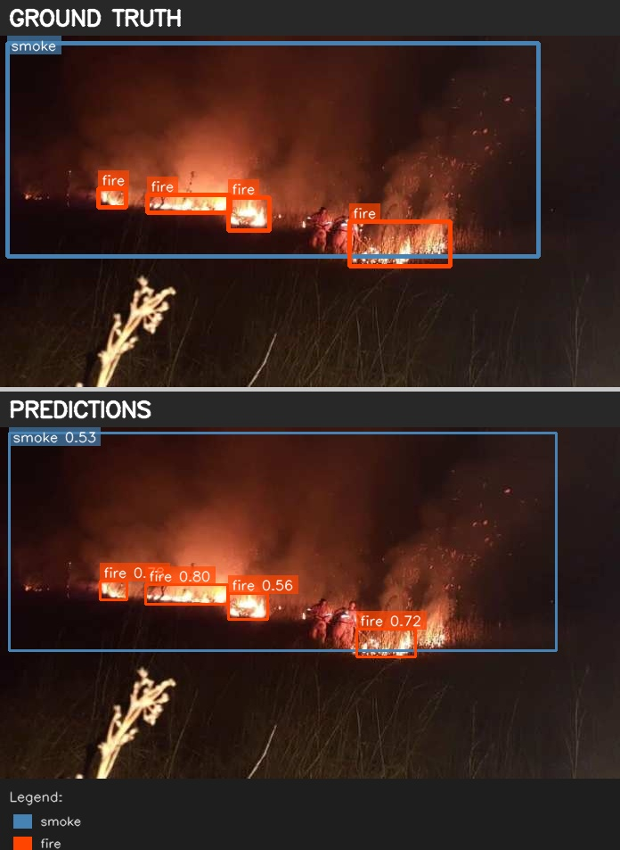
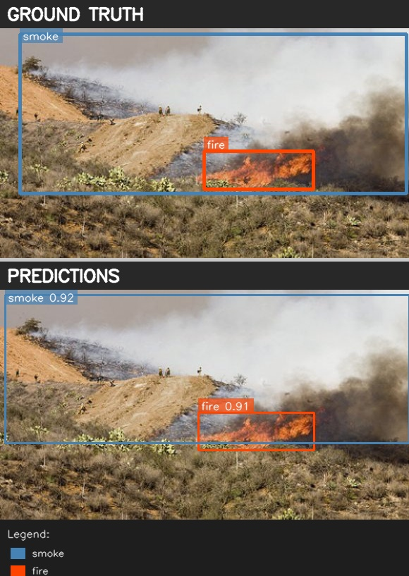
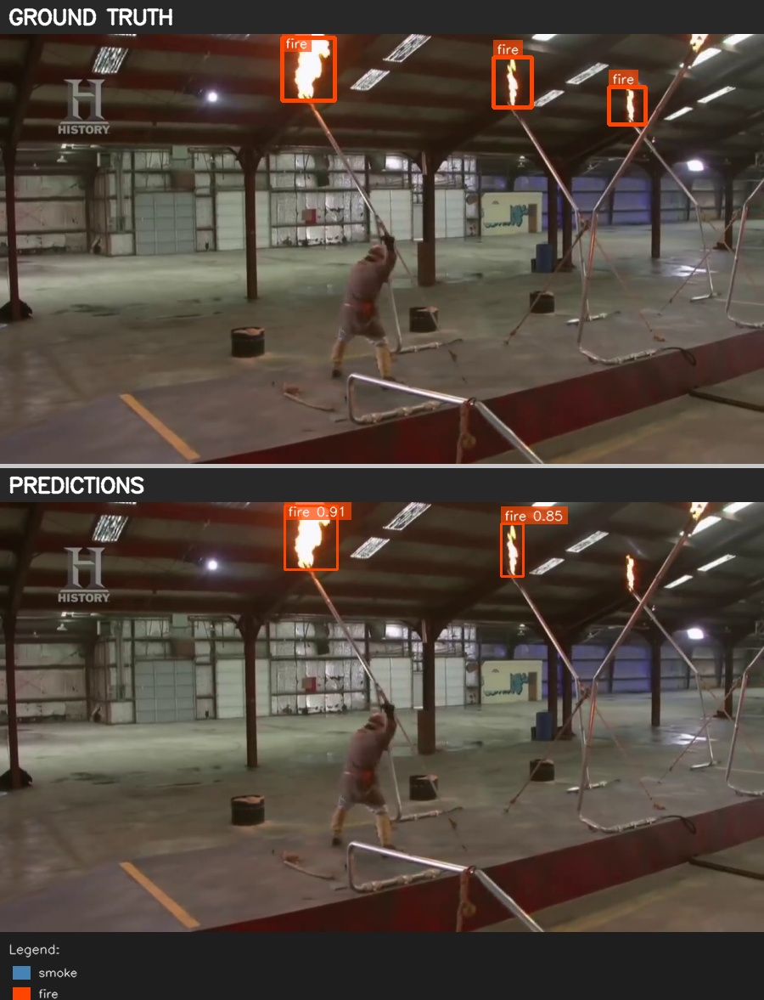
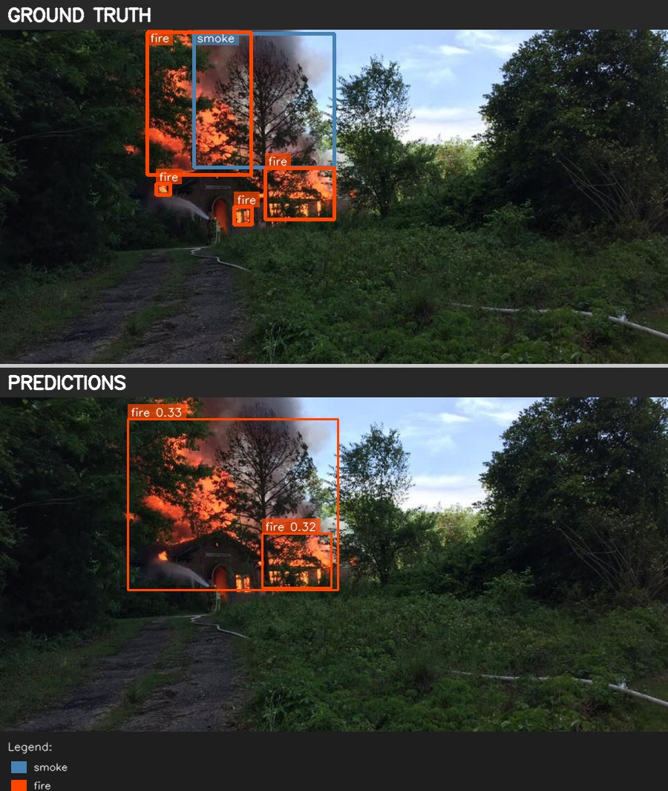
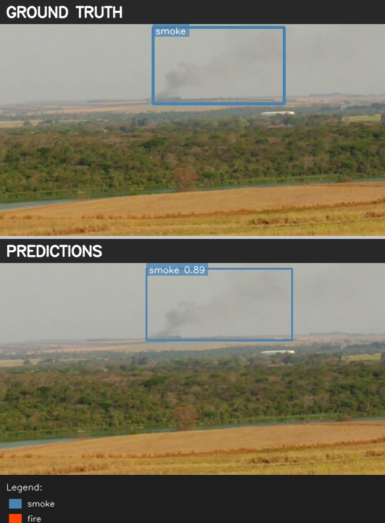
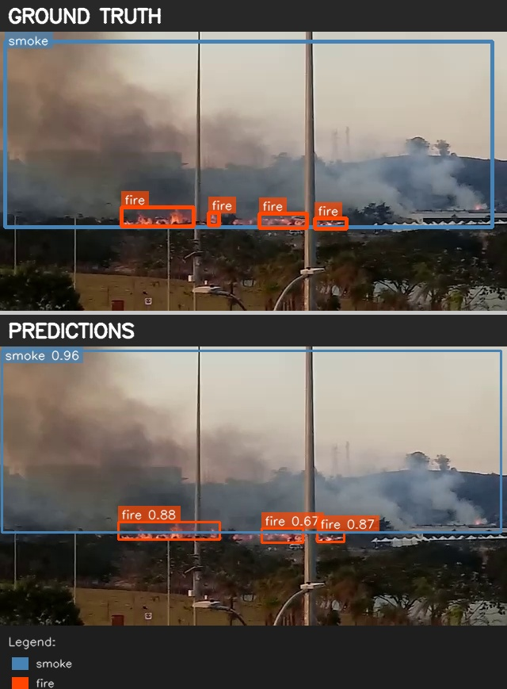
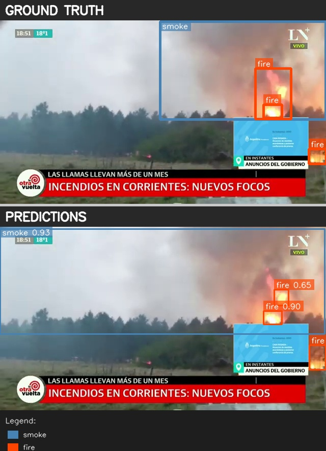
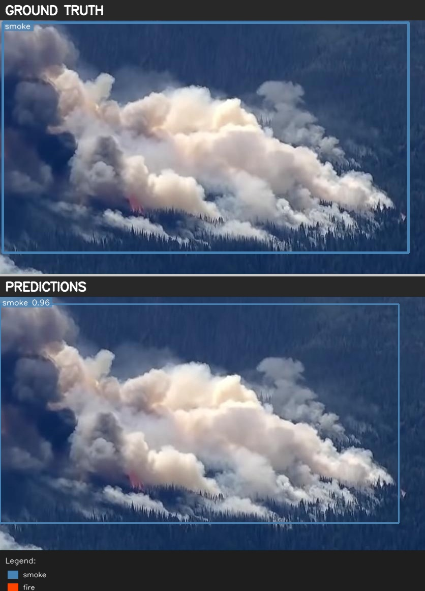

# Fire and Smoke Detection

Real-time fire and smoke detection system optimized for real-time video processing on consumer-grade GPUs.

## Overview

This project develops a lightweight object detection model for identifying fire and smoke from images. The solution uses YOLO26L detection model trained on the Dfire dataset and optimized with TensorRT INT8 quantization to achieve high throughput while maintaining strong detection accuracy.

## Dataset

**Dfire Dataset**: A comprehensive fire detection dataset containing images from various sources including:
- Aerial/drone footage
- Ground-level camera feeds  
- Indoor and outdoor scenarios
- Day and night conditions
- Various fire intensities and smoke densities

**Training Split:**
- Training images: Used for model training
- Validation images: Used during training
- Test images: 4,306 images (1,115 with fire, 2,081 with smoke, 2,005 background)
- Ground truth boxes (test): 5,193 total (2,878 fire, 2,315 smoke)

**Classes:**
- Class 0: Smoke
- Class 1: Fire

## Model Comparison

Three object detection architectures were trained and evaluated:

| Model | Parameters | mAP@50 | mAP@50:95 | Inference Speed (FP32) |
|-------|-----------|---------|-----------|----------------------|
| **YOLO26l** | ~25M | **0.7668** | **0.4472** | 129.7 img/s |
| YOLO26m | ~16M | 0.7748 | 0.4493 | 158.3 img/s |
| RT-DETR | ~32M | 0.7803 | 0.4345 | 60.2 img/s |

**YOLO26l** was selected as the final model due to its excellent balance of accuracy and optimization potential with TensorRT.

## Training Configuration

- **Architecture**: YOLO26 Large
- **Input size**: 640×640
- **Epochs**: 100
- **Batch size**: 24
- **Optimizer**: SGD with auto learning rate
- **Data augmentation**: HSV, translation, scaling, flip, mosaic, RandAugment
- **Device**: NVIDIA L4 GPU (24GB VRAM)

## Evaluation Results (YOLO26l - PyTorch FP32)

### Overall Metrics

| Metric | Value |
|--------|-------|
| mAP@0.50 | 0.7668 |
| mAP@0.50:0.95 | 0.4472 |
| Precision (avg) | 0.7898 |
| Recall (avg) | 0.7491 |

### Per-Class Performance

**Smoke Detection:**
- AP@50: 0.8323
- AP@75: 0.5394
- Best F1: 0.8252 (confidence=0.342)
- Precision: 0.8360
- Recall: 0.8147

**Fire Detection:**
- AP@50: 0.7014
- AP@75: 0.3483
- Best F1: 0.7071 (confidence=0.415)
- Precision: 0.7557
- Recall: 0.6644

### Confusion Matrix Summary (conf ≥ 0.25, IoU ≥ 0.50)

| Metric | Smoke | Fire |
|--------|-------|------|
| True Positives | 1,922 | 2,045 |
| False Negatives | 381 | 822 |
| False Positives (from background) | 454 | 935 |

## Model Optimization & Quantization

The model was quantized using TensorRT with multiple precision modes and batch sizes. All benchmarks conducted on NVIDIA L4 GPU:

### Quantization Results

| Model | Precision | Recall | mAP50 | mAP50:95 | Latency (ms) | Throughput (img/s) | Size (MB) |
|-------|-----------|--------|-------|----------|--------------|-------------------|-----------|
| PT-FP32-B16 | 0.7898 | 0.7491 | 0.7894 | 0.4805 | 7.71 | 129.74 | 53.0 |
| PT-FP16-B64 | 0.7901 | 0.7503 | 0.7888 | 0.4799 | 6.96 | 143.68 | 53.0 |
| TRT-FP16-B16 | 0.7970 | 0.7379 | 0.7790 | 0.4665 | 3.59 | 278.87 | 54.4 |
| **TRT-INT8-B16** | **0.8475** | **0.6319** | **0.7667** | **0.4444** | **2.18** | **459.32** | **31.0** |
| TRT-INT8-B32 | 0.8496 | 0.6299 | 0.7648 | 0.4455 | 2.32 | 431.26 | 31.4 |
| TRT-INT8-B64 | 0.8500 | 0.6301 | 0.7646 | 0.4451 | 2.46 | 405.83 | 31.4 |

### Selected Model: TRT-INT8-B16

**Performance Highlights:**
- **Throughput**: 459 img/s on L4 GPU
- **Latency**: 2.18 ms per image
- **Model size**: 31 MB (41% smaller than FP32)
- **Speedup**: 3.54× faster than PyTorch FP32
- **Accuracy**: mAP@50 = 0.7667 (97% of baseline)

The INT8 model provides excellent speed with minimal accuracy loss

**📊 View Complete Quantization & Evaluation Reports:**
- [YOLO26l Quantization Report](YOLO26l/YOLO26l_Quantization/optimized_models_yolo26l/quantization_report.txt)
- [YOLO26m Quantization Report](YOLO26m/YOLO26m_Quantization/optimized_models_yolo26m/quantization_report.txt)
- [RT-DETR Quantization Report](RTDETR/RTDETR_Quantization/optimized_models_rtdetr/quantization_report.txt)

Each report includes detailed metrics for:
- PyTorch FP32/FP16 models (batch sizes 16, 32, 64)
- TensorRT FP16 engines (batch sizes 16, 32, 64)
- TensorRT INT8 engines (batch sizes 16, 32, 64)
- Latency, throughput, model size comparisons
- Accuracy trade-offs for each optimization

## Detection Visualizations

### Fire Detection Examples

<table>
<tr>
<td width="50%"></td>
<td width="50%"></td>
</tr>
<tr>
<td width="50%"></td>
<td width="50%"></td>
</tr>
</table>

### Smoke Detection Examples

<table>
<tr>
<td width="50%"></td>
<td width="50%"></td>
</tr>
<tr>
<td width="50%"></td>
<td width="50%"></td>
</tr>
</table>

## Download Models and Complete Results

Due to the large size of model files and complete evaluation results, all project artifacts are hosted on Google Drive:

**📁 [Download Complete Project Files from Google Drive](https://drive.google.com/drive/folders/1f7-pTov6M6ZUjG3o-urrcrw-zVAHnJLN?usp=sharing)**

### What's Included

The Google Drive folder contains:

- **YOLO26l/** - Complete YOLO26l experiments
  - Training artifacts and checkpoints
  - Full evaluation results with visualizations
  - Quantized models (TensorRT engines: FP16, INT8 for batch sizes 16, 32, 64)
  - Quantization reports

- **YOLO26m/** - Complete YOLO26m experiments
  - Training artifacts
  - Evaluation results
  - Quantized models

- **RT-DETR/** - Complete RT-DETR experiments
  - Training artifacts
  - Evaluation results
  - Quantized models

### Quick Download Guide

**Option 1: Download Everything**

**Option 2: Download Only What You Need**

For inference only:
1. Download `YOLO26l/YOLO26l_Quantization/optimized_models_yolo26l/yolo26l_best_int8_bs16.engine`
2. Download `YOLO26l/YOLO26l_Evaluation/yolo26l_best.pt`
3. Place in your local `models/` directory

## Inference Scripts

Two inference scripts are provided for different deployment scenarios:

### 1. TensorRT Inference (Recommended)

**File**: `inference_tensorrt.py`

Optimized inference using TensorRT INT8 quantized model for maximum performance.

```bash
python inference_tensorrt.py --video /path/to/video.mp4 --output results/
```

**Features:**
- Batch size 16 processing for optimal throughput
- Handles hours-long videos with streaming frame processing
- Outputs predictions in JSON and CSV formats
- Real-time FPS monitoring
- Memory-efficient for long videos

**Arguments:**
```
--video         Path to input video file
--model         Path to TensorRT engine (default: models/yolo26l_int8_bs16.engine)
--output        Output directory for predictions (default: output/)
--conf-thresh   Confidence threshold (default: 0.25)
--iou-thresh    NMS IoU threshold (default: 0.65)
--batch-size    Batch size for inference (default: 16)
--skip-frames   Process every Nth frame (default: 1, process all frames)
```

**Output Format:**
- `predictions.json`: Structured JSON with frame numbers, bounding boxes, confidence scores, class labels
- `predictions.csv`: Tabular CSV format (frame, class, confidence, x1, y1, x2, y2)
- `summary.txt`: Detection statistics and performance metrics

### 2. PyTorch Inference (Fallback)

**File**: `inference_pytorch.py`

Pure PyTorch inference using FP16 precision for systems without TensorRT.

```bash
python inference_pytorch.py --video /path/to/video.mp4 --output results/
```

**Features:**
- FP16 half-precision for faster inference (~144 img/s)
- Identical interface to TensorRT script
- No TensorRT dependencies required
- Same output formats (JSON + CSV)

**Arguments:**
```
--video         Path to input video file
--model         Path to PyTorch model (default: models/yolo26l_best.pt)
--output        Output directory for predictions (default: output/)
--conf-thresh   Confidence threshold (default: 0.25)
--iou-thresh    NMS IoU threshold (default: 0.65)
--batch-size    Batch size for inference (default: 16)
--skip-frames   Process every Nth frame (default: 1)
--half          Use FP16 precision (default: True)
```

## Docker Deployment

Docker setup optimized for RTX 4080 deployment with TensorRT support.

### Build Docker Image

```bash
docker build -t fire-detection:latest .
```

### Run Inference in Container

```bash
# Run with GPU support
docker run --gpus all \
  -v /path/to/videos:/data/videos \
  -v /path/to/output:/data/output \
  fire-detection:latest \
  python inference_tensorrt.py \
  --video /data/videos/test_video.mp4 \
  --output /data/output/
```

### Interactive Container

```bash
# Launch interactive session for testing
docker run --gpus all -it \
  -v /path/to/videos:/data/videos \
  -v /path/to/output:/data/output \
  fire-detection:latest \
  /bin/bash
```

### Docker Compose (Optional)

```bash
docker-compose up
```

### Requirements

- NVIDIA Docker runtime (`nvidia-docker2`)
- NVIDIA GPU with CUDA 12.x support
- Docker 20.10+
- NVIDIA Driver 525+ (for RTX 4080)

**Installation:**
```bash
# Install NVIDIA Docker runtime
distribution=$(. /etc/os-release;echo $ID$VERSION_ID)
curl -s -L https://nvidia.github.io/nvidia-docker/gpgkey | sudo apt-key add -
curl -s -L https://nvidia.github.io/nvidia-docker/$distribution/nvidia-docker.list | \
  sudo tee /etc/apt/sources.list.d/nvidia-docker.list
sudo apt-get update && sudo apt-get install -y nvidia-docker2
sudo systemctl restart docker

# Test GPU access
docker run --rm --gpus all nvidia/cuda:12.1.0-base-ubuntu22.04 nvidia-smi
```

## Repository Structure

```
.
├── README.md                       # This file
├── Dockerfile                      # Docker image definition
├── requirements.txt                # Python dependencies
├── inference_tensorrt.py           # TensorRT inference script
├── inference_pytorch.py            # PyTorch inference script
├── models/                         # Model files
│   ├── yolo26l_int8_bs16.engine   # TensorRT INT8 model (batch=16)
│   ├── yolo26l_best.pt            # PyTorch FP32 model
│   └── dataset.yaml               # Class configuration
├── assets/                         # Documentation assets
│   └── visualizations/            # Example detection images
├── YOLO26l/                        # YOLO26l training/evaluation
│   ├── YOLO26l_Training/          # Training artifacts
│   ├── YOLO26l_Evaluation/        # Evaluation results
│   └── YOLO26l_Quantization/      # Quantization experiments
├── YOLO26m/                        # YOLO26m experiments
└── RTDETR/                         # RT-DETR experiments
```

## Installation (Local)

### Prerequisites

The models were trained and evaluated with the following environment:

- **Python**: 3.10+
- **CUDA**: 13.0
- **cuDNN**: 9.15.1
- **TensorRT**: 10.15.1+ (for TensorRT inference)
- **GPU**: NVIDIA L4 (24GB VRAM) - also works on RTX 4080, RTX 3090, etc.

### Install Dependencies
```
**Option 1: Install with CUDA 13.0 (Recommended - matches training environment)**

# Install PyTorch with CUDA 13.0 support
pip install torch==2.10.0 torchvision==0.25.0 --index-url https://download.pytorch.org/whl/cu130

# Install other dependencies
pip install -r requirements.txt

# Install TensorRT (for TensorRT inference)
pip install tensorrt>=10.15.0

**Option 2: Install with CUDA 12.x (Alternative)**

# Install PyTorch with CUDA 12.1 support
pip install torch torchvision --index-url https://download.pytorch.org/whl/cu121

# Install other dependencies
pip install -r requirements.txt

# Install TensorRT
pip install tensorrt

# NOTE: You MUST rebuild TensorRT engines when using different CUDA versions

### Download Models

Models are provided in the `models/` directory:
- `yolo26l_int8_bs16.engine` (TensorRT model)
- `yolo26l_best.pt` (PyTorch model)

## Usage Examples

### Process Single Video

```bash
# Using TensorRT (fastest)
python inference_tensorrt.py \
  --video dashcam_footage.mp4 \
  --output results/ \
  --conf-thresh 0.3

# Using PyTorch (no TensorRT required)
python inference_pytorch.py \
  --video dashcam_footage.mp4 \
  --output results/ \
  --conf-thresh 0.3
```

### Process with Frame Skipping

For extremely long videos, process every Nth frame:

```bash
python inference_tensorrt.py \
  --video long_video.mp4 \
  --output results/ \
  --skip-frames 2  # Process every 2nd frame (15 FPS from 30 FPS input)
```

### Batch Processing Multiple Videos

```bash
for video in videos/*.mp4; do
  python inference_tensorrt.py \
    --video "$video" \
    --output "results/$(basename $video .mp4)/"
done
```

## Output Format

### JSON Output (`predictions.json`)

```json
{
  "video_info": {
    "path": "video.mp4",
    "total_frames": 18000,
    "fps": 30.0,
    "resolution": [1920, 1080]
  },
  "detections": [
    {
      "frame": 1523,
      "timestamp": 50.77,
      "objects": [
        {
          "class": "fire",
          "confidence": 0.89,
          "bbox": [345, 123, 567, 289]
        },
        {
          "class": "smoke",
          "confidence": 0.92,
          "bbox": [123, 45, 678, 234]
        }
      ]
    }
  ],
  "summary": {
    "total_detections": 234,
    "fire_count": 145,
    "smoke_count": 89,
    "avg_fps": 38.5
  }
}
```

### CSV Output (`predictions.csv`)

```csv
frame,timestamp,class,confidence,x1,y1,x2,y2
1523,50.77,fire,0.89,345,123,567,289
1523,50.77,smoke,0.92,123,45,678,234
```

## Troubleshooting

### TensorRT Engine Not Compatible

If you encounter TensorRT compatibility issues:

```bash
# Rebuild engine for your specific GPU
python rebuild_engine.py --input models/yolo26l_best.onnx --output models/yolo26l_int8_bs16.engine
```

Or use PyTorch inference as fallback:

```bash
python inference_pytorch.py --video video.mp4
```

### Out of Memory Errors

Reduce batch size:

```bash
python inference_tensorrt.py --video video.mp4 --batch-size 8
```

### Low FPS Performance

- Check GPU utilization: `nvidia-smi`
- Use TensorRT instead of PyTorch
- Enable frame skipping for very long videos
- Ensure CUDA and drivers are properly installed

## Acknowledgments

- **Dfire Dataset**: Public fire detection dataset
- **Ultralytics YOLOv11**: State-of-the-art object detection framework
- **TensorRT**: NVIDIA's high-performance deep learning inference optimizer
